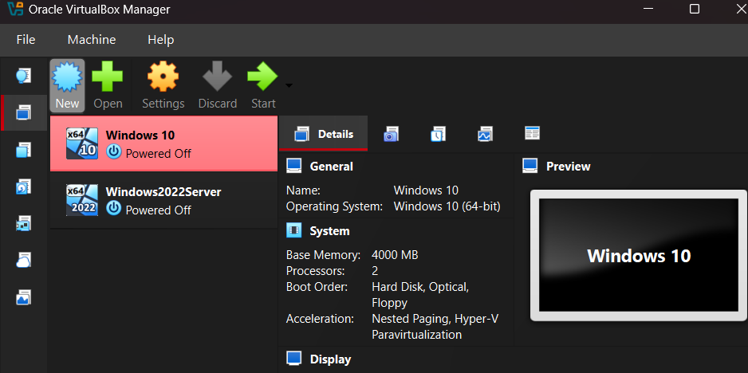

<h1>Active Directory</h1>

<h2>Description</h2>
Project consists of a simple PowerShell script that walks the user through "zeroing out" (wiping) any drives that are connected to the system. The utility allows you to select the target disk and choose the number of passes that are performed. The PowerShell script will configure a diskpart script file based on the user's selections and then launch Diskpart to perform the disk sanitization.
 

<h2>Project walk-through:</h2>

Create the Windows 10 and Windows 2022 Server machines:  

 
 
Right click the network icon and select "Open Network and Internet Settings":   

 
 
Scroll down and click on "change adapter options" and then right click on the displayed adapter. Then click on "properties":  

 
 
Click on the selected box and then select "properties":   

 
 
Fill in the boxes with the displayed settings for the sake of simplicity, then click "ok":   

 
 
Start the Windows 2022 Server VM and repeat the previous steps and fill in the following information:   

 
 
Open up the Server Manager and click "Manage" in the top right corner. Click "add roles" and then "next" and verify that the following is selected. Then click "next" and then "next" again:   

 
 
Select "Active Directory Domain Services" and then click "add features." Continue clicking "next" until you reach and select "install":   

 
 
Once it finishes installing, click "close" and return to the Server Manager Dashboard. Select the flag with the warning icon at the top right and click on "promote this server to a domain controller":   

 
 

  

