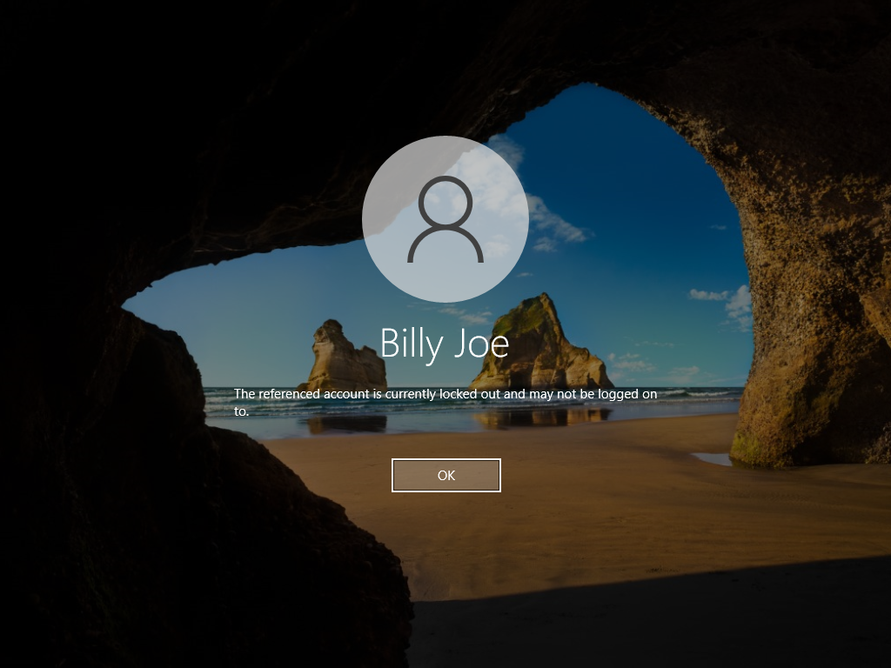
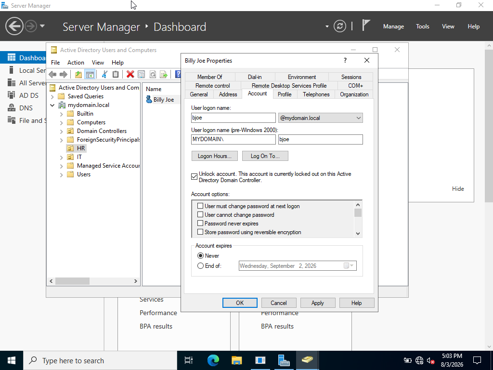

<h2>Ticket #01: Account Locked Out</h2>

<strong>Reported Issue:</strong> 
User states they are unable to log into their workstation and receives a message indicating their account is locked.

<strong>Priority:</strong> High

<strong>Environment:</strong> Windows 10 Pro client (WIN10-CLIENT01), user account "jsmith" in the IT OU, domain-joined to corp.local

<strong>Troubleshooting Steps:</strong>

<ol>
  <li>Verified the exact error message on the client. Confirmed it stated that the account was locked out.</li>
  <li>Confirmed with the user that it was caused by repeated failed login attempts.</li>
  <li>Opened Active Directory Users and Computers on the DC and located the affected user account.</li>
  <li>Checked the Account tab and confirmed the "account is locked out" flag was active.</li>
</ol>

<strong>Root Cause:</strong> 
The user typed their password in correctly but the "caps lock" key was on.

<strong>Steps Taken to Resolve:</strong> 

Confirmed that Billy Joe was locked out:  

 
 
Navigated to Billy Joe's account and unlocked it:  

 
 
Confirmed that Billy Joe was now able to sign in:  

 
 

<strong>What I Learned:</strong> 
In this project I learned how to unlock a user's account after multiple failed password attempts on their part. I also learned how to modify group password policies so that I could simulate this ticket.

<a href="https://github.com/nickuunn/Active-Directory-Home-Lab/tree/main/tickets">← Back to tickets</a>

