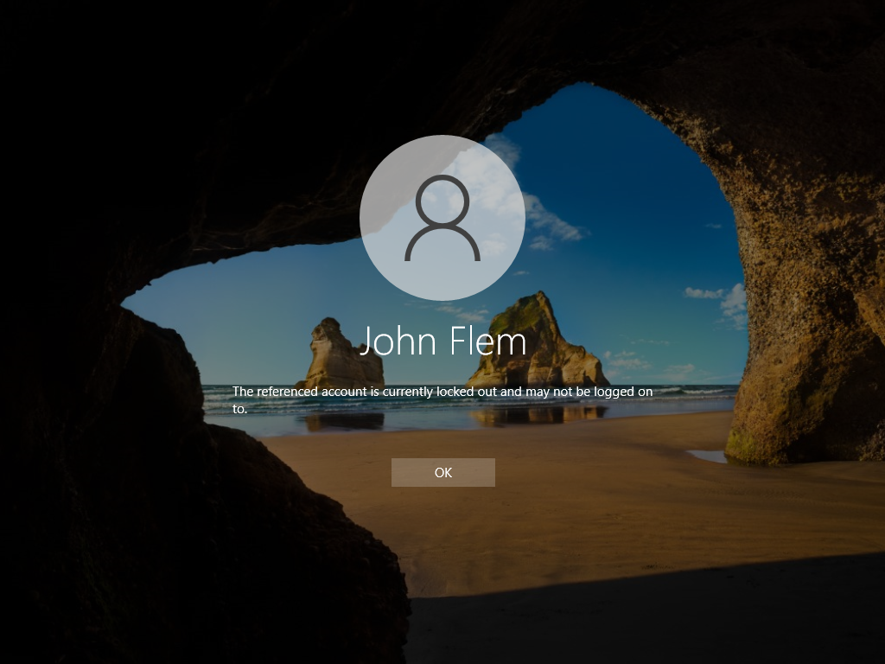
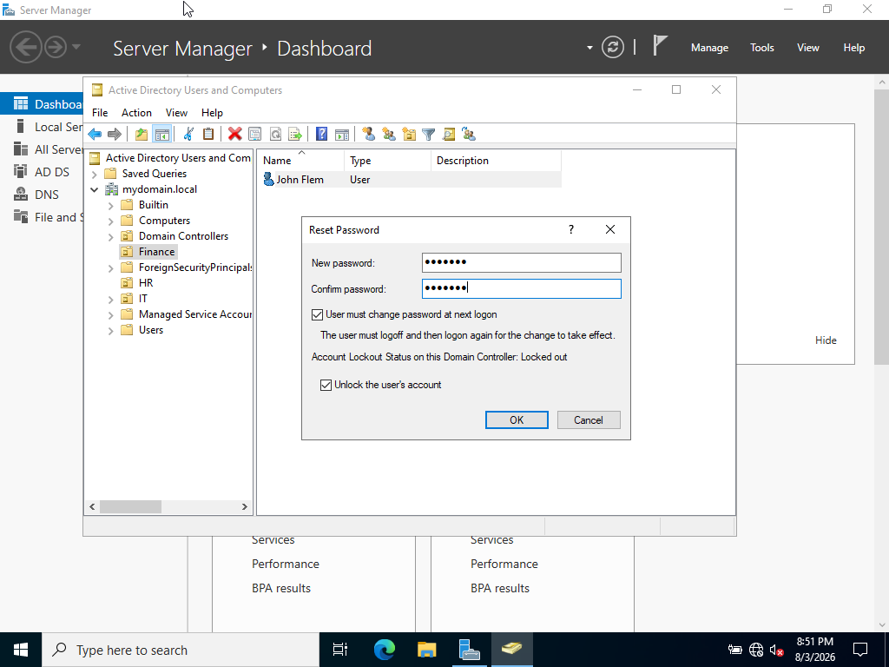
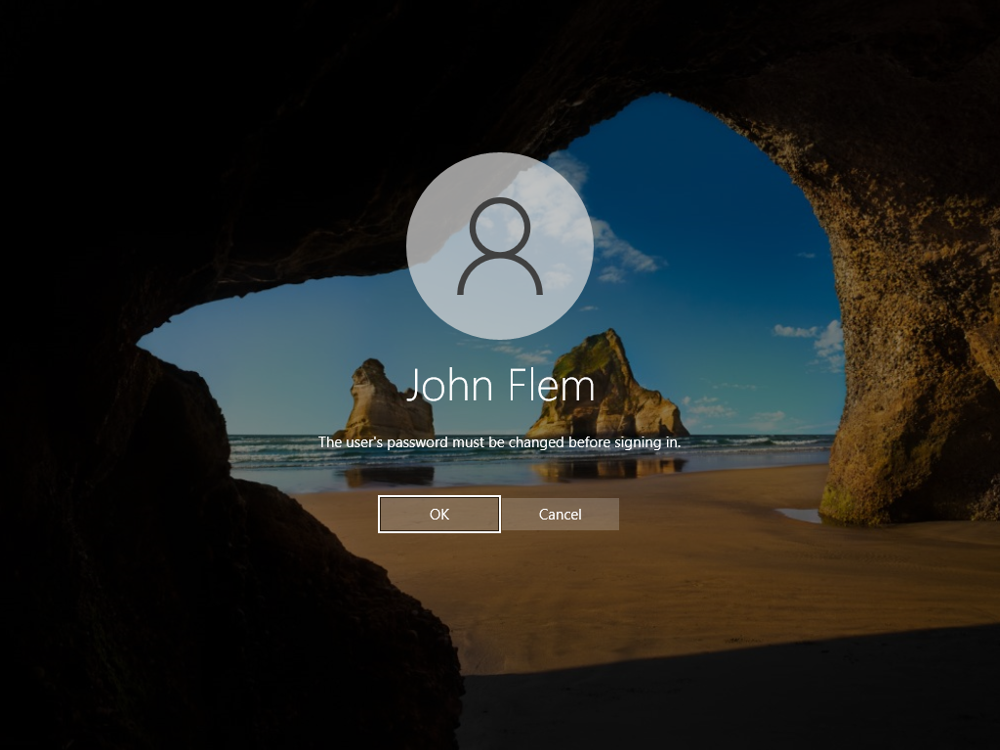
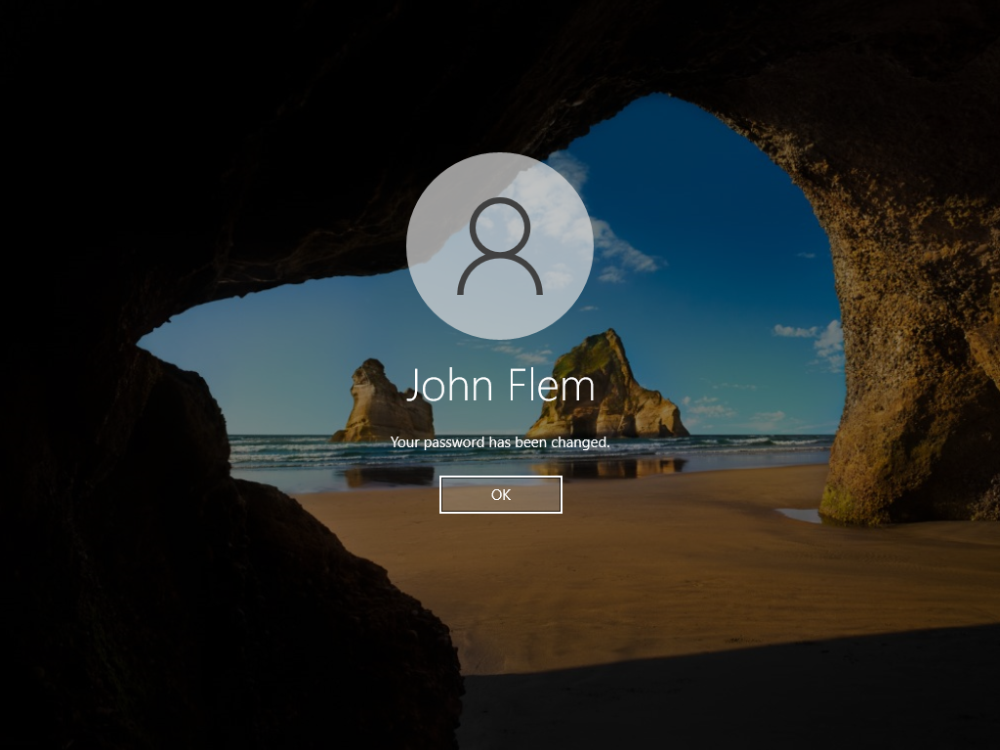

<h2>Ticket #02: Resetting a User's Password</h2>

<strong>Reported Issue:</strong> 
John Flem from the Finance department states that he lost the sticky note with his computer password on it and would like it reset so he can get back to work.

<strong>Priority:</strong> High

<strong>Environment:</strong> Windows 10 Pro client (WIN10-CLIENT01), user account "jflem" in the Finance OU, domain-joined to mydomain.local

<strong>Troubleshooting Steps:</strong>

<ol>
  <li>Confirmed the user's identity and account name before making any changes, per standard password reset procedure.</li>
  <li>Opened Active Directory Users and Computers on the DC and located John Flem's account in the Finance OU.</li>
  <li>Right-clicked the account and selected "Reset Password."</li>
  <li>Set a temporary password and checked "User must change password at next logon" so John would set his own password on next login.</li>
</ol>

<strong>Root Cause:</strong> 
User forgot his password after losing the physical note it was written on — not a technical failure, a standard access request.

<strong>Steps Taken to Resolve:</strong> 

Confirmed that John Flem was locked out due to forgotten password:  

 
 
Navigated to John Flem's account and unlocked it. Along with setting a new password that John Flem will be prompted to change when he signs in:  

 
 
Confirmed that John Flem was now able to sign in and prompted to create a new password:  

 
 
Confirmed that John Flem was able to successfully change his password and sign in:  

 
 

<strong>What I Learned:</strong> 
In this project I learned how to reset a user's password along with the importance of having a secure and realiable way to store your passwords.

<a href="https://github.com/nickuunn/Active-Directory-Home-Lab/tree/main/tickets">← Back to tickets</a>

