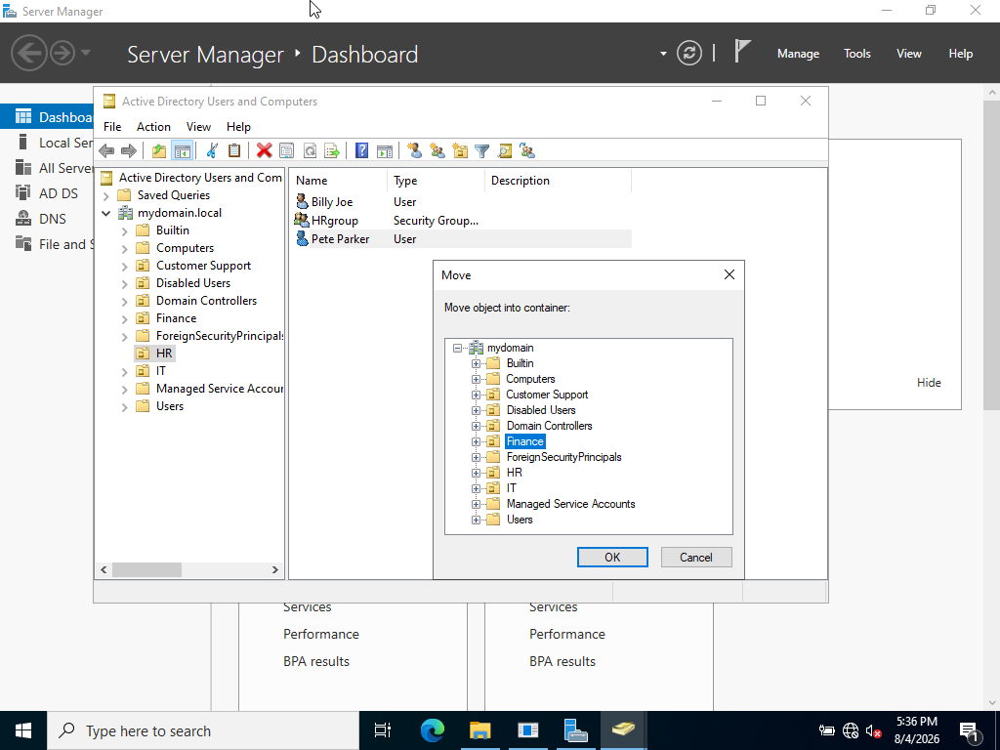
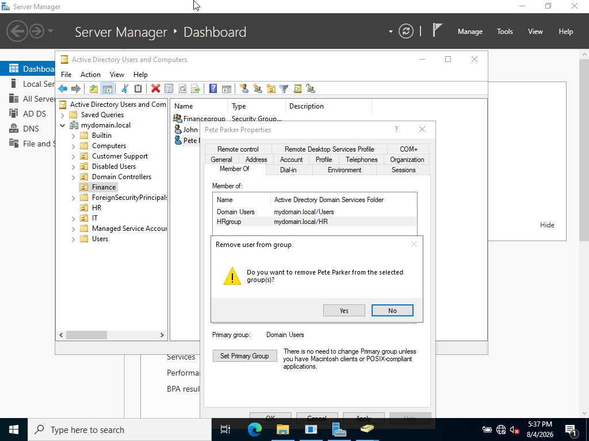
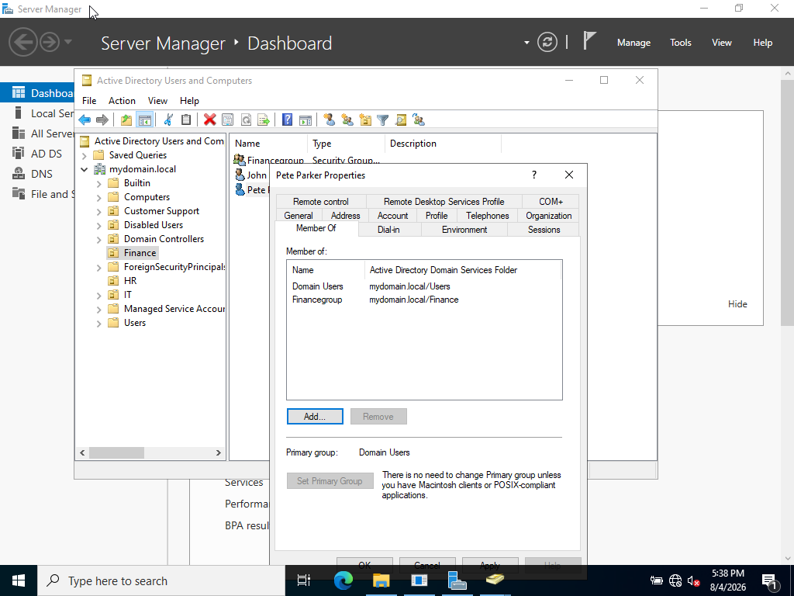

<h2>Ticket #04: Managing User Access</h2>

<strong>Reported Issue:</strong> 
Pete Parker from the HR department is transitioning over to the Finance department. His user access must be changed so that he no longer has access to any files containing sensitive HR information.

<strong>Priority:</strong> High

<strong>Environment:</strong> Windows 10 Pro client (WIN10-CLIENT01), user account "ppark" in the HR OU, domain-joined to mydomain.local

<strong>Troubleshooting Steps:</strong>

<ol>
  <li>Confirmed with the requester which OU and security group Pete needed moved to before making any changes.</li>
  <li>Opened Active Directory Users and Computers on the DC and located Pete Parker's account in the HR OU.</li>
  <li>Right-clicked the account and selected "Move," relocating Pete from the HR OU to the Finance OU.</li>
  <li>Removed Pete from the HR security group and added him to the Finance security group under the Member Of tab.</li>
</ol>

<strong>Root Cause:</strong> 
Not a technical issue — a standard access change resulting from an internal department transfer.

<strong>Steps Taken to Resolve:</strong> 

Moved Pete Parker from the HR department to the Finance department:  

 
 
Removed Pete Parker from the HR group:  

 
 
Added Pete Parker to the Finance group:  

 
 

<strong>What I Learned:</strong> 
In this project I learned how to create groups and assign users to different groups depending on what was needed.

<a href="https://github.com/nickuunn/Active-Directory-Home-Lab/tree/main/tickets">← Back to tickets</a>

