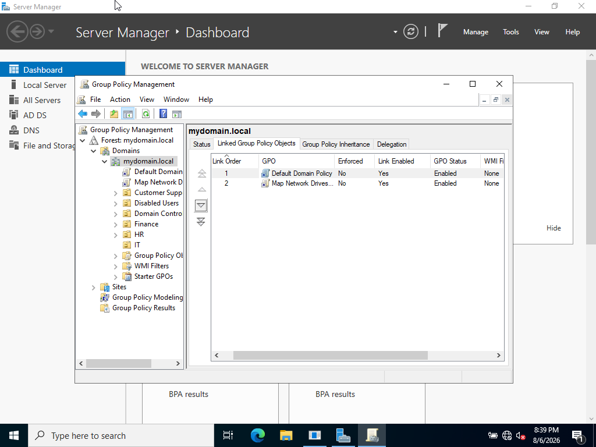
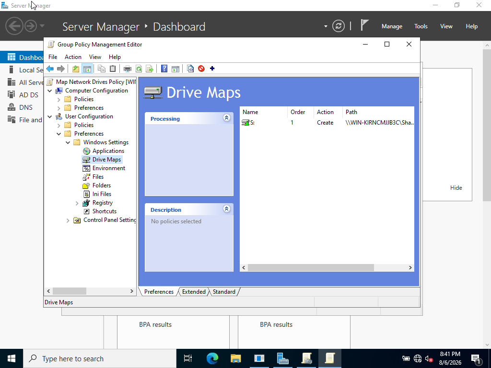
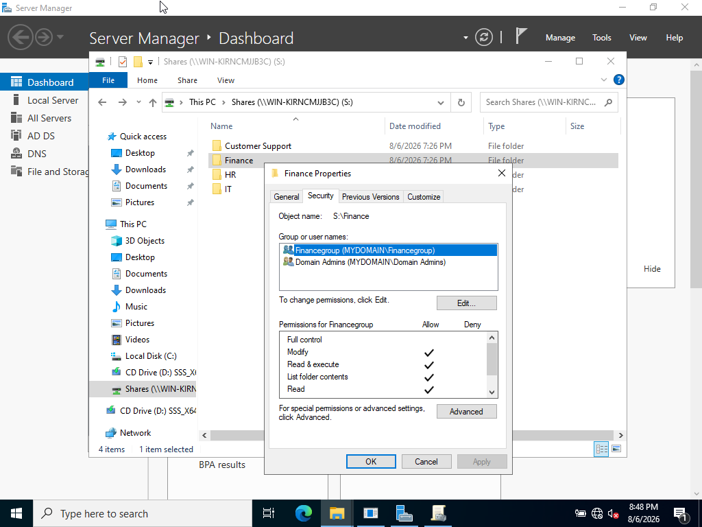
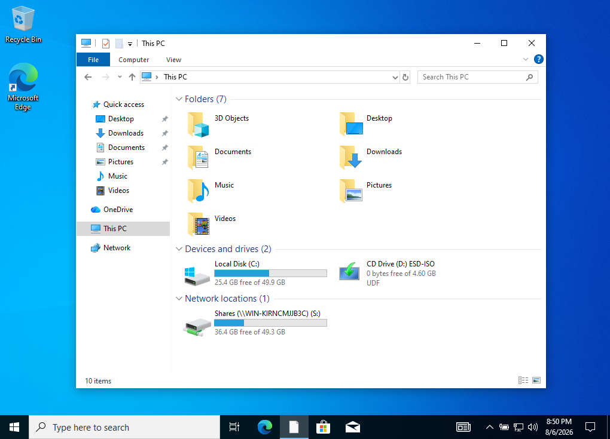
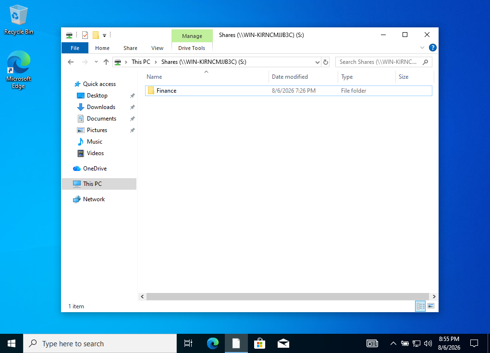
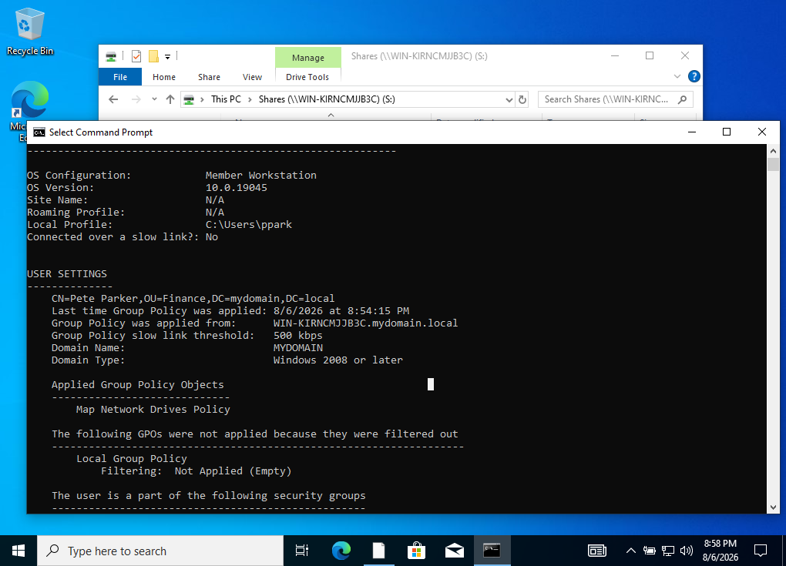

<h2>Ticket #05: Deploying a Company Wide Shared Drive</h2>

<strong>Reported Issue:</strong> 
IT management has requested a centralized shared drive be set up for all departments, so employees can access department-specific files without relying on local storage or manually requesting individual file shares from IT.

<strong>Priority:</strong> Medium

<strong>Environment:</strong> Domain-wide deployment, applies to all OUs under mydomain.local

<strong>Troubleshooting Steps:</strong>

<ol>
  <li>Created a centralized folder structure on the server (C:\Shares) with department-specific subfolders (Finance, HR, IT, Customer Support).</li>
  <li>Shared the parent folder over the network and configured NTFS permissions on each subfolder so only the matching department security group could access it.</li>
  <li>Created a GPO to map the shared drive to a consistent drive letter (S:) for all users.</li>
  <li>Initially linked the GPO to a single OU for testing — confirmed with a test account that the drive mapped correctly.</li>
  <li>Realized the GPO needed to be linked at the domain root instead, so the drive would map for all employees company-wide, not just one department, while NTFS permissions handle the actual access restriction per folder.</li>
  
</ol>

<strong>Root Cause:</strong> 
Not a technical failure — a proactive infrastructure deployment to standardize file access across departments and reduce local, unmanaged file storage.

<strong>Steps Taken to Resolve:</strong> 

Linked GPO at the domain root:  

 
 
The GPO drive map:  

 
 
NTFS permissions on the finance folder:  

 
 
The shared drive is present for the finance user (Pete Parker):  

 
 
Since Access Based Enumeration is enabled, the finance user is unable to see other department folders:  

 
 
Further proof that the GPO is correctly applied to user:  

 
 

<strong>What I Learned:</strong> 
In this project I learned how to create groups and assign users to different groups depending on what was needed.

<a href="https://github.com/nickuunn/Active-Directory-Home-Lab/tree/main/tickets">← Back to tickets</a>

